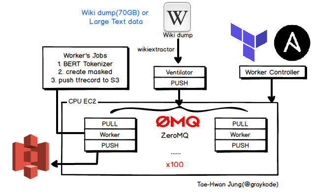

# mlm-pipeline

`mlm-pipeline` is a cloud architecture that preprocesses the masked language model (mlm).

[](https://jalammar.github.io/illustrated-bert/)



In NLP, a masked Languge Model (MLM) such as BERT, XLM, RoBERTa, and ALBERT, pretraining the sentence's input with `[MASK]` is a state-of-a-art.

`Input Text: the man jumped up , put his basket on phil ##am ##mon ' s head`
`Original Masked Input: [MASK] man [MASK] up , put his [MASK] on phil
[MASK] ##mon ' s head`

However, the preprocessing process of tokenizing and masking a few hundred GB of large text takes a lot of time with a single node. We use a multi-node architecture that distributes preprocessing through the cloud architecture's pipeline design with **pull-push pattern**.

- `ventilator` : Read large text and deliver message to zmq's queue. ventilator is a single node.
- `worker` : 1) BERT Tokenizer, 2) Create Masked on sentences, 3) push preprocessed tfrecord to S3
- `worker controller` : using Terraform, Ansible, we can control all ec2s and dynamic provisioning ec2 on AWS.


## Usage

### prepare wiki dump data

(If you don't use this wiki data, you can cancel this step). extract the text with
[WikiExtractor.py](https://github.com/attardi/wikiextractor). It took about an hour using 96 core ec2.

```shell
wget https://dumps.wikimedia.org/enwiki/latest/enwiki-latest-pages-articles.xml.bz2
bzip2 -dk enwiki-latest-pages-articles.xml.bz2

python3 WikiExtractor.py -o \
  ../output --processes 80 \
  ../enwiki-latest-pages-articles.xml
```


# 

### dynamic provisioning EC2(worker) on AWS

- [Installing Terraform](https://learn.hashicorp.com/terraform/getting-started/install.html)
- [Installation Guide Ansible](https://docs.ansible.com/ansible/latest/installation_guide/intro_installation.html)

```shell
(run on your local pc)
chmod +x init.sh
./init.sh
git clone https://github.com/graykode/mlm-pipeline

export AWS_ACCESS_KEY_ID='xxxxxxx'
export AWS_SECRET_ACCESS_KEY='xxxxxx'

cd worker_controller/terraform
terraform init
```

change some variable in [variables.tf](https://github.com/graykode/mlm-pipeline/blob/master/worker_controller/terraform/variables.tf)

- region, zone, **number_of_worker** , client_instance_type, volume_size, **client_subnet**, **client_security_groups**, default_keypair_name
- you must **open ventilation port** when create client_security_groups.

Then run below:

```shell
(run on your local pc)
terraform apply
```

or if you want to destroy all, type `terraform destroy`


### command to all ec2 nodes in one time.

```shell
(run on your local pc)
cd ../ansible

# ping test
ansible-playbook -i ./inventory/ec2.py \
      --limit "tag_type_worker" \
      -u ubuntu \
      --private-key ~/.ssh/SoRT.pem ping.yaml
      
# install python packagement(ex tensorflow, boto, zmq, ..)
ansible-playbook -i ./inventory/ec2.py \
      --limit "tag_type_worker" \
      -u ubuntu \
      --private-key ~/.ssh/SoRT.pem init.yaml \
      --extra-vars "aws_access_key_id=<key_id> aws_secret_access_key=<access_key>" -vvvv
```

`aws_access_key_id` and `aws_secret_access_key` will be in environment variable (`/etc/environment`) to using boto s3. change as your `<key_id>`, `<access_key>`.


### ventilation setting

```shell
(in ventilation ec2)
wget https://raw.githubusercontent.com/graykode/mlm-pipeline/master/init.sh
# init shell for ventilator
sudo apt update && sudo apt install -y python3 && \
      sudo apt install -y python3-pip && \
      pip3 install zmq
```


### Start in workers and ventilation order

```shell
(run on your local pc)
ansible-playbook -i ./inventory/ec2.py \
      --limit "tag_type_worker" \
      -u ubuntu \
      --private-key ~/.ssh/SoRT.pem working.yaml \
      --extra-vars "bucket_name=<bucket_name> vserver=<ventilator_ip>"
      
(in ventilation ec2)
python3 ventilator.py \
  --data 'data folder path' \
  --vport 5557 \
  --time 0.88  
```


## License

MIT


## Author

- Tae Hwan Jung(Jeff Jung) @graykode, Kyung Hee Univ CE(Undergraduate).
- Author Email : [nlkey2022@gmail.com](mailto:nlkey2022@gmail.com)
